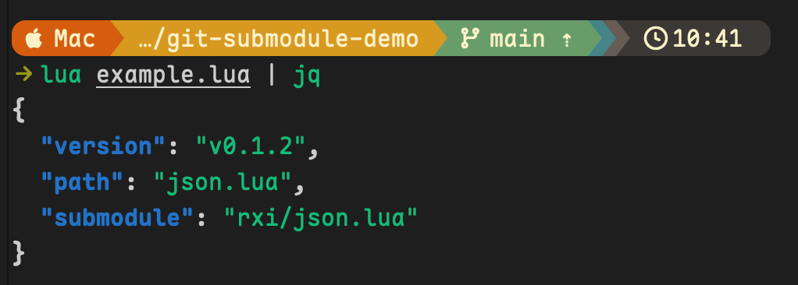
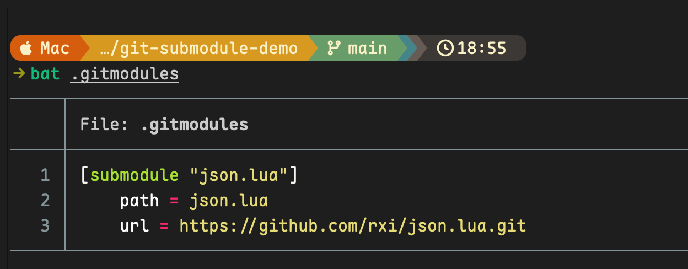
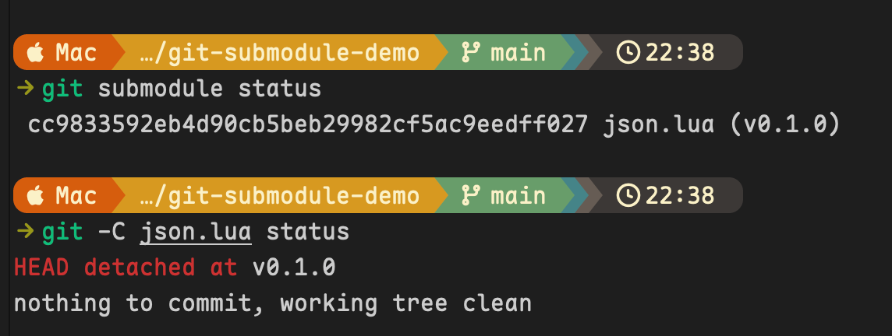
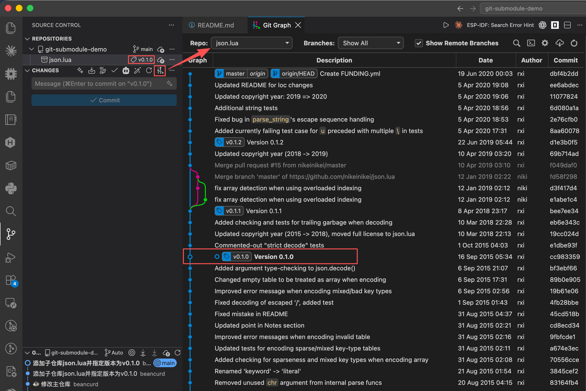
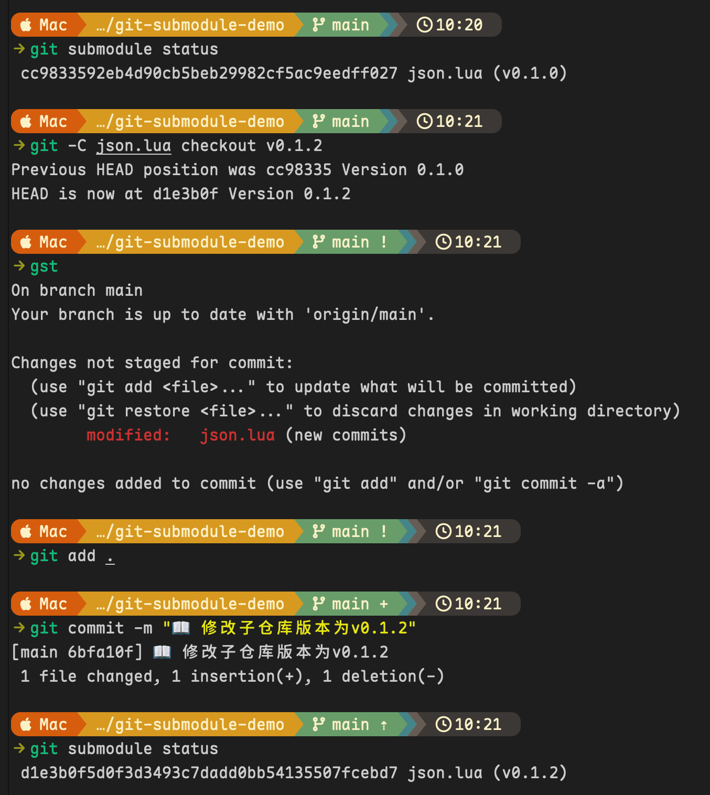
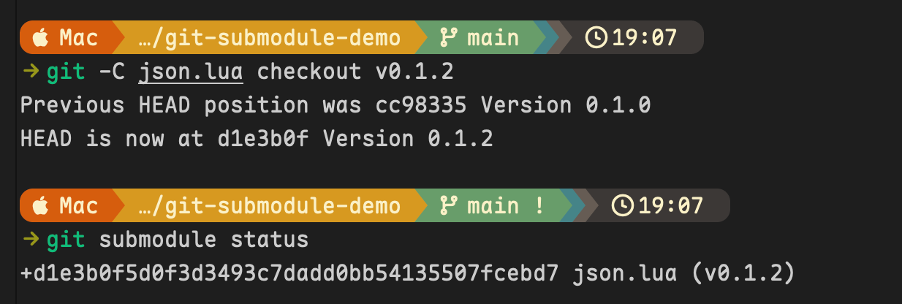

# Git 子模块实操演示

[](https://git-scm.com/docs/git-submodule)
[](https://github.com/rxi/json.lua/tree/v0.1.2)
[](https://www.lua.org/)
[](LICENSE)

> [!NOTE]
> Git 子模块（submodule）适合在主仓库中引用外部仓库，并将其固定到特定提交。`git submodule` 用于管理主仓库与子模块之间的引用关系；`git -C <path>` 用于在子仓库目录中执行普通 Git 命令。

## 快速体验

克隆主仓库并同时初始化子模块：

```sh
git clone --recurse-submodules https://github.com/Orionxer/git-submodule-demo.git
cd git-submodule-demo
lua example.lua
```

如已安装 [`jq`](https://jqlang.org/)，可以格式化示例输出：

```sh
lua example.lua | jq
```



## 常用命令

### git submodule

`git submodule` 管理主仓库与子模块之间的引用关系。主仓库不会保存子模块的全部文件，而是通过 `.gitmodules` 保存路径和远程地址，并在 Git 提交中记录子模块的特定 commit。

| 命令 | 作用 |
| --- | --- |
| `git submodule add <URL> <path>` | 添加子模块并写入 `.gitmodules` |
| `git submodule status` | 查看各子模块当前检出的 commit 和状态 |
| `git submodule update --init --recursive` | 初始化、拉取并检出主仓库记录的 commit |
| `git submodule deinit <path>` | 注销子模块的本地配置并清理工作区 |
| `git submodule sync --recursive` | 将 `.gitmodules` 中的 URL 同步到本地配置 |

### git -C

`-C <path>` 表示执行后续 Git 命令前先切换到 `<path>`。它不会改变当前 Shell 的工作目录。

```sh
# 两种写法的效果相同
git -C json.lua status
cd json.lua && git status
```

在子模块场景中，可以从主仓库根目录直接操作指定子仓库：

| 命令 | 作用 |
| --- | --- |
| `git -C <path> status` | 查看子仓库工作区状态 |
| `git -C <path> rev-parse HEAD` | 输出子仓库当前的完整 commit hash |
| `git -C <path> describe --tags --exact-match` | 检查当前 commit 是否精确对应某个 Tag |
| `git -C <path> checkout <tag>` | 将子仓库切换到指定 Tag、分支或 commit |
| `git -C <path> remote -v` | 查看子仓库的远程地址 |
| `git -C <path> log --oneline` | 以简洁格式查看子仓库提交历史 |

可以简单记成：`git submodule` 管理引用关系，`git -C` 操作子仓库内部。

## 添加子模块

> [!Tip]
> 本仓库以 [`rxi/json.lua`](https://github.com/rxi/json.lua) 为例，演示子模块的添加、版本切换、初始化、同步与删除。

在主仓库根目录执行：

```sh
git submodule add https://github.com/rxi/json.lua.git json.lua
```

此时 `.gitmodules` 会记录子模块的路径和远程地址：

```sh
cat .gitmodules
```



主仓库通过 `gitlink` 记录子模块的具体 commit，而不是分支或 Tag。执行 `git submodule add` 时，Git 默认检出远端默认分支当时的 HEAD；主仓库保存该 commit 后，子模块不会自动跟随远端更新。

## 指定子模块版本

> [!Important]
> 添加子仓库的原则：主仓库添加子仓库的时候，通过子仓库提交的哈希进行链接（也叫注册`register`），因此需要在添加子仓库之后指定 **Release** 或 **Tag** 版本。一般处于 Release 或已经发布 Tag 状态下的哈希提交**处于稳定状态**，而且也便于维护。如果没有指定，则子仓库会在默认分支下挑选一个最新提交，但是该提交不确保稳定性。

例如固定到 `v0.1.0`：

```sh
git -C json.lua fetch --tags
git -C json.lua checkout v0.1.0
git add .gitmodules json.lua
```

主仓库记录的是 `v0.1.0` 所指向的 commit，因此子模块处于 detached HEAD 状态是正常现象。

## 检查子模块

### 查看所有子模块

```sh
cat .gitmodules
git submodule status
```



`git submodule status` 输出开头的字符代表：

- 空格：当前检出的 commit 与主仓库记录一致。
- `-`：子模块尚未初始化。
- `+`：当前检出的 commit 与主仓库记录不一致。
- `U`：子模块存在合并冲突。

### 检查 Tag 或 commit

检查当前 commit 是否精确对应某个 Tag：

```sh
git -C json.lua describe --tags --exact-match
```

查看完整 commit hash：

```sh
git -C json.lua rev-parse HEAD
```

查看主仓库当前提交记录的子模块 gitlink：

```sh
git ls-tree HEAD -- json.lua
```

输出中的文件模式 `160000` 表示该条目是子模块，后面的哈希是主仓库固定的子模块 commit。

查看子仓库自身的工作区状态：

```sh
git -C json.lua status
```

### 使用 VS Code Git Graph 查看



### 查看远程地址

```sh
git -C json.lua remote -v
```

## 切换子模块版本

例如从当前版本切换到 `v0.1.2`：

```sh
git -C json.lua fetch --tags
git -C json.lua checkout v0.1.2
```



此时主仓库会将 `json.lua` 显示为 modified，因为子模块指针已经改变：

```sh
git submodule status
git status
```



让主仓库记录新的子模块 commit：

```sh
git add json.lua
```

## 克隆和初始化

### 克隆时同时拉取子模块

```sh
git clone --recurse-submodules https://github.com/Orionxer/git-submodule-demo.git
```

### 克隆后再初始化

如果普通克隆时没有拉取子模块：

```sh
git clone https://github.com/Orionxer/git-submodule-demo.git
cd git-submodule-demo
git submodule update --init --recursive
```

`--recursive` 表示同时初始化子模块内部声明的嵌套子模块。

## 恢复主仓库记录的版本

如果只是切换了子模块的 commit，且希望恢复到主仓库记录的版本：

```sh
git submodule update --checkout -- json.lua
```

该命令不会无条件丢弃子仓库内部未提交的文件修改。操作前应先检查：

```sh
git -C json.lua status
```

## 修改子模块远程地址

对于体积较大的依赖，可以把上游仓库 Fork 或镜像到局域网 Git 服务，再修改子模块 URL，以减少外网流量和同步时间。实际效果取决于局域网传输速度。

例如将 `json.lua` 改为另一个远程地址：

```sh
git submodule set-url json.lua https://github.com/rxi/json.lua.git
```

```sh
git submodule sync --recursive
```

修改 `.gitmodules` 中的 URL 后，`sync` 会将其同步到本地主仓库的 `.git/config`。

### `sync` 与 `update` 的区别

| 命令 | 同步对象 | 作用 |
| --- | --- | --- |
| `git submodule sync --recursive` | 子模块配置 | 同步 URL，不拉取或切换代码 |
| `git submodule update --init --recursive` | 子模块代码 | 初始化、拉取并检出主仓库记录的 commit |

修改远程地址后，通常依次执行：

```sh
git submodule sync --recursive
git submodule update --init --recursive
```

可以简单记成：`sync` 同步地址，`update` 获取并检出代码。

## 删除子模块

操作前先检查子仓库是否存在需要保留的修改：

```sh
git -C json.lua status
```

### 1. 注销本地子模块

```sh
git submodule deinit -- json.lua
```

如果确认可以丢弃子仓库中的本地修改，才使用 `-f`：

```sh
git submodule deinit -f -- json.lua
```

### 2. 删除主仓库中的子模块记录

```sh
git rm -- json.lua
```

这会删除主仓库索引中的 `gitlink`，并移除 `.gitmodules` 中相应的配置段。

### 3. 删除内部缓存（可选）

```sh
rm -rf -- .git/modules/json.lua
```

如果 `.gitmodules` 已经为空，可以将其删除：

```sh
git rm -- .gitmodules
```

上述命令只产生待提交的删除变化，不会自动创建提交。

## 核心理解

- `.gitmodules` 保存子模块名称、路径和远程地址，不保存当前 commit。
- 主仓库的 Git 提交通过 `gitlink` 保存子模块 commit。
- 主仓库固定的是 commit，而不是 Tag 或分支名称。
- `git submodule update` 默认检出主仓库记录的 commit，不会自动更新到远端最新版本。
- 子模块常见的 detached HEAD 状态是固定依赖版本时的正常现象。

## 参考资料

- [Pro Git：Git 工具—子模块](https://git-scm.com/book/zh/v2/Git-工具-子模块)
- [git-submodule 命令文档](https://git-scm.com/docs/git-submodule)
